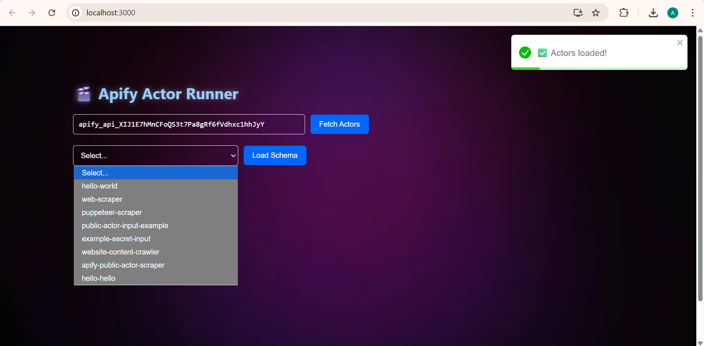
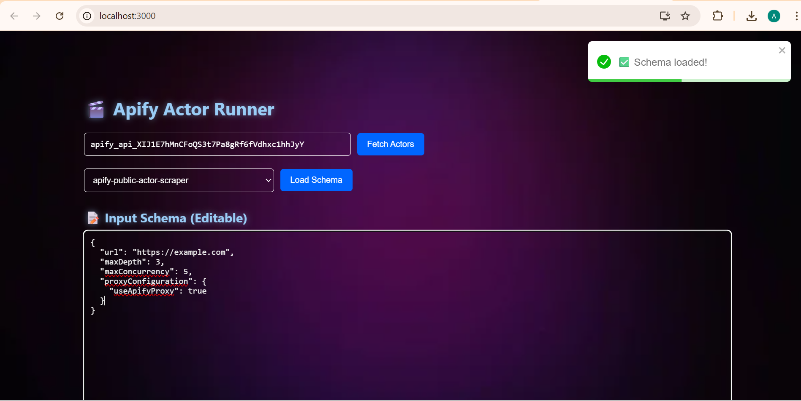
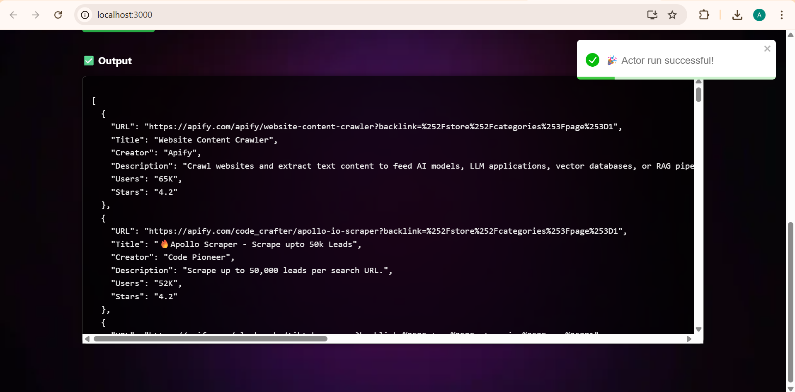

# 🎬 Apify Actor Runner

A full-stack web application to dynamically browse, configure, and execute **Apify actors** using your Apify API key. It supports schema loading (including AI-powered fallbacks), actor execution, and result visualization in an interactive UI.

---

## 📦 Features

- ✅ Fetch all actors associated with your Apify API key
- ✅ Load JSON input schemas for any public/private actor
- ✅ AI-powered fallback schema generation using OpenRouter
- ✅ Edit and submit actor inputs via an intuitive editor
- ✅ View and copy actor execution results
- ✅ Fully responsive dark-themed UI with toast notifications
- ✅ Background image support

---

## 🚀 How to Install and Run

### 1. Clone the Repository

    ```bash
    git clone https://github.com/your-username/apify-actor-runner.git
    cd apify-actor-runner

2. Backend Setup

        cd backend
        npm install

- Create a .env file inside the backend/ folder:

  OPENROUTER_API_KEY=your_openrouter_api_key_here
  
- 💡 Sign up at ([OpenRouter.ai](https://openrouter.ai)) and use your API key from their dashboard.

3. Frontend Setup

       cd ../frontend
       npm install

4. Run the App

- In two terminals, run both the frontend and backend:

# Terminal 1 (Backend)
        cd backend
        node index.js

# Terminal 2 (Frontend)
        cd frontend
        npm start

- Open http://localhost:3000 in your browser.

## 🧪 Actor Used for Testing
- We used the public Apify actor: eloquent_mountain/apify-public-actor-scraper

- Actor ID format used:eloquent_mountain~apify-public-actor-scraper

- This actor outputs visible data and has a retrievable schema or sample inputs, making it ideal for integration testing.

## 💡 Design Assumptions & Notes

We assume some public actors might not expose a formal /input-schema. Therefore, we implemented:

Fallback #1: Try to load the last successful run input

Fallback #2: Use OpenRouter + GPT to generate a plausible sample schema (AI-powered)

Frontend JSON input is editable, allowing manual overrides if needed.

All requests are routed via Express backend for secure handling of API keys.

The UI uses React, react-toastify, and custom styles with transparent backgrounds and notifications.

## 🌈 Screenshots

### 🎬 Actor Selection


### 📝 Schema Editor


### ✅ Output Viewer



## 🛠️ Tech Stack
    
    Frontend: React, Axios, Toastify

    Backend: Express.js, Axios, dotenv

    AI API: OpenRouter (uses OpenAI-compatible API structure)

    Styling: Custom inline styles + bg.jpg image

## 📬 Applicant

Made by Anuhya Mattaparthi

email: anuhya.mattaparthi@gmail.com
